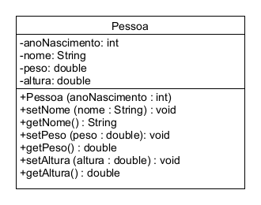
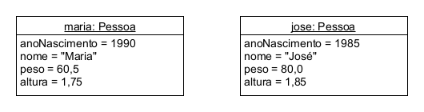
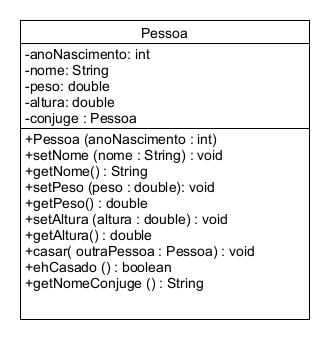

# Exercícios práticos para o básico de orientação a objetos 
## Exercício 1.1 (Pessoas)
Crie um novo projeto e desenvolva a classe Pessoa, conforme diagrama de classes a seguir.

* Observe que ha um construtor com um argumento: o ano de nascimento.
* Atraves do encapsulamento, garanta a consistencia do estado dos objetos.

Instancie os dois objetos mostrados no diagrama de objetos abaixo.

Porque a classe Pessoa não define um método setAnoNascimento?

## Exercício 1.2 (PessoasCasadas) 
Modifique a classe Pessoa conforme diagrama de classes a seguir.

* O método casar() seta o conjuge da pessoa.
* O método ehCasado() returna true se a pessoa tiver um conjuge (ou seja, se
 conjuge != null).
* O método getNomeConjuge() deve retornar o nome do conjuge.

Em seguida, realize as seguintes operações:
1. Crie os objetos maria e jose do exercício anterior.
2. Case o objeto maria com o objeto jose.
3. Execute o método ehCasado() nos dois objetos. O resultado é consistente?
4. Execute o método getNomeConjuge() do objeto jose. O resultado é consistente?
5. Execute o método getNomeConjuge() do objeto maria. O resultado é consistente?
   * Qual erro ocorreu? Por que ocorreu este erro?
6. Modifique a classe Pessoa para garantir a consistencia de estado:
   * Uma pessoa só pode casar com outra pessoa que não é casada.
   * A relação de conjuge deve ser consistente nas duas pessoas.

## Exercício 1.3 (EstudantesCreditos) 
Deseja-se representar os estudantes da turma por meio de objetos. Além do nome e do número de matrícula do estudante, o objeto deve armazenar também a quantidade de créditos já cursados. O objeto deve encapsular os dados do estudante, atentando para os seguintes detalhes:

a. Após criado o objeto, não é possível alterar o número de matrícula do estudante, apenas seu nome.

b. Deve haver um método para adicionar créditos, que incrementa a quantidade de créditos já cursados pelo estudante. Não deve haver método para setar diretamente a quantidade de créditos.

c. Deve haver um método para calcular e retornar o login do aluno, que é formado pelos três primeiros caracteres do nome do aluno + os três últimos dígitos da matrícula.

Exemplo: Nome: Angelina; Matrícula: 556644; Login = Ang644.
dica ( no Java o tipo String tem um metodo substring() que pode ser chamado a partir da string, funciona como se cada letra fosse uma posição de um vetor, assim ao chamar o metodo substring(0,3) vai retorna a primeira posição e até a segunda, excluindo a ultima. 

d. Deve haver um método para retornar uma String com a representação textual do aluno. Formato: Nome: ___, Matrícula: ___, Login: ___, Créditos: ___.

Exemplo: Nome: Angelina, Matrícula: 556644, Login: Ang644, Créditos: 36.
 

Roteiro para resolver o exercício:

1. Elabore um diagrama de classes.

2. Elabore um diagrama de objetos, contendo os objetos est1 e est2 a seguir:
   * est1: Angelina, matrícula 556644, cursou 35 créditos.
   * est2: Beth, matrícula 579035, cursou 80 créditos.

3. Desenvolva um projeto com a implementação. Instancie os dois objetos acima para testar os métodos.

4. Crie uma classe com um método main e implemente a criação dos objetos est1 e est2 modelados no seu diagrama de objetos. Ative os métodos necessários para que o estado desses objetos seja igual ao do diagrama de objetos. Após criados e inicializados, implemente as seguintes manipulações dos objetos nesta ordem.
Atenção: os objetos devem permanecer consistentes ao longo das manipulações.

est1:
  * Retornar e imprimir o login.
  * Retornar e imprimir a representação textual.
  * Adicionar 4 créditos.
  * Retornar e imprimir a representação textual.
  * Alterar o nome para Angelina Siqueira.
  * Retornar e imprimir o login.
  *  Retornar e imprimir a representação textual.

est2:
  * Retornar e imprimir a representação textual.
  * Adicionar -8 créditos (atenção: valor negativo para testar).
  * Retornar e imprimir a representação textual.
  * Alterar o nome para Elizabeth.
  * Retornar e imprimir o login.
